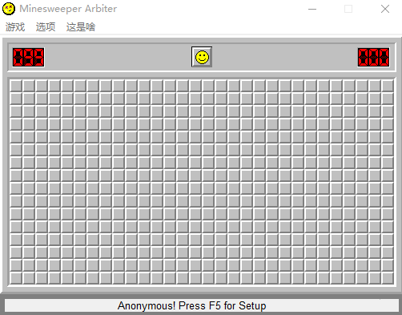

# AutoMinesweeper
**自动扫雷软件**
>python2

>blog地址：[http://home.cahhbwy.cn/index.php/2017/03/09/autominesweeper/](http://home.cahhbwy.cn/index.php/2017/03/09/autominesweeper/)

>扫雷软件来自[扫雷网](http://saolei.net/Main/Index.asp)Arbiter_0.52.3版

>快速传送门[下载扫雷](http://saolei.net/Download/Arbiter_0.52.3.zip)

>**程序打开请禁用高分辨率缩放**

>需要python模块：numpy, pyautogui, Pillow，使用pip安装即可

此工程自[另一仓库文件夹](https://github.com/cahhbwy/python-workspace/tree/master/AutoMinesweeper)下搬运过来

#### src/
>图片参考数据，其中0~8.png和mine.png、mine_dead.png、mine_flag.png、mine_wrong、none.png为游戏中的单个块的情况，已通过采样像素的编码的方式做优化，不需要这些图像，如果更换扫雷游戏版本，需要重新采样图片进行编码。

>左上.png和右下.png为确定窗口位置所用，更换游戏版本需要重新截图并调整findPanel函数中参数

>ImageEncode.py，为找编码写的程序，更换游戏版本**参考**程序重新编码

### AutoMinesweeper.py
>自动扫雷单模块版，单独（加上src/左上.png、src/右下.png）可运行；**新增不标雷玩法，在noFlag分支上**

### 以下是程序的多模块版本
#### GlobalData.py
>_存储扫雷游戏全局变量_

#### Identify.py
>_识别窗口位置，识别每个方块的类型_

#### Control.py
>_模拟鼠标点击事件_

#### Analysis.py
>_分析当前战况，做出判断_

#### main.py
>_主函数_
